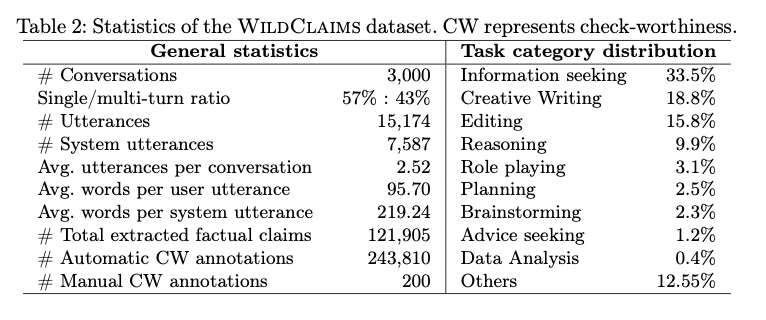

# Information Access Conversations in the Wild(Chat)

This repository provides the **annotations, prompts, and analysis scripts** used in the paper *“WildClaims: Information Access Conversations in the Wild(Chat)”*.  
It is intended as a resource to help researchers **reproduce the reported results**, explore the annotated datasets, and extend the analyses.  

Each script corresponds to a section of the paper and generates specific statistics or evaluation metrics directly from the released annotations.

## Methods Overview

This repository builds on prior work in **claim extraction** and **check-worthiness detection**.  
We use the following methods, as described in the paper:

- **FHuo (Huo et al. 2023)** — Extracts factual statements from system utterances by prompting an LLM directly. 
  [[Paper link]](https://dl.acm.org/doi/fullHtml/10.1145/3624918.3625336/)  

- **FSong (Song et al. 2024)** — Extracts only *verifiable* factual claims. Produces broader coverage, yielding nearly 3× more claims than FHuo.  
  [[Paper link]](https://aclanthology.org/2024.findings-emnlp.552//)  

- **Hassan (Hassan et al. 2015)** — one of the earliest check-worthiness detection approaches, originally based on crowd annotation guidelines. In our work, we adapted it into an LLM prompt to classify claims as check-worthy or not.  
  [[Paper link]](https://dl.acm.org/doi/10.1145/2806416.2806652)  

- **Majer (Majer & Šnajder 2024)** — A recent check-worthiness detection method, using an effective LLM prompt designed to identify both factual and check-worthy factual claims.  
  [[Paper link]](https://aclanthology.org/2024.fever-1.27//)  

These methods are combined in different ways (e.g., intersection, union) to estimate the prevalence of check-worthy claims and to evaluate classifier effectiveness (See Section 4.1 of the paper).

## Statistics




## Annotation Files

### `Annotations/run_analysis.csv`

This file contains the **utterance-level results** used for check-worthiness analysis.  
Each row corresponds to a single agent utterance within a conversation.

**Columns:**

- `Conversation_Hash`: Unique identifier for each conversation  
- `Turn_Num`: Turn number within the conversation (1, 2, 3, …)  
- `Corresponding_User_Question`: The user’s question/input for this turn  
- `Selected_Agent_Utterance`: The agent’s response/utterance for this turn  
- `Selected_Agent_Column`: Column identifier (e.g., *Utterance-1 (Agent)*)  
- `Task_Classification`: Task type (e.g., *Information seeking*, *Creative Writing*, …)  
- `Use`: Usage flag (TRUE/FALSE)  

**Check-worthiness outputs:** (arrays of booleans, one per extracted claim)  
- `FHuo_Hassan`: Using **FHuo** claim extraction + *Hassan* check-worthiness classifier  
- `FSong_Hassan`: Using **FSong** claim extraction + *Hassan* check-worthiness classifier  
- `FHuo_Majer`: Using **FHuo** extraction + *Majer* check-worthiness classifier   
- `FSong_Majer`: Using **FSong** extraction + *Majer* check-worthiness classifier   
- `FHuo_Intersection`: Intersection of *Hassan* and *Majer* results (FHuo extraction)  
- `FSong_Intersection`: Intersection of *Hassan* and *Majer* results (FSong extraction)  
- `FHuo_Union`: Union of *Hassan* and *Majer* results (FHuo extraction)  
- `FSong_Union`: Union of *Hassan* and *Majer* results (FSong extraction)  

**Counts:**  
- `*_Fact_Num`: Number of check-worthy facts identified by each method  
- `*_Fact_Total`: Total number of facts extracted by each method


### `Annotations/Human_Annotation.csv`

This file contains **200 human-annotated claims** used for inter-annotator agreement analysis and evaluation of automatic check-worthiness classifiers.

**Basic Information**
- `Claim_Extr_Method`: Claim extraction method used (*FHuo* or *FSong*)  
- `Ver`: Version identifier  
- `Conversation_Hash`: Unique identifier for the conversation  
- `Individual_Statement`: The specific claim being annotated  
- `Task_Classification`: Task type of the conversation turn  

**Human Annotations**
- `Human1_Annotation`, `Human2_Annotation`: Full-label classifications by each annotator (*NFS, UFS, CFS*)  
- `Human1_CW`, `Human2_CW`: Binary check-worthiness decisions (TRUE/FALSE)  
- `Human1_Human2_Agree`: Agreement flag (TRUE if both annotators agree)  
- `Check_Worthy`: Tie-breaking annotation label (applied when Human1 and Human2 disagree)  
- `CW_Tie`: Tie-breaking binary decision (TRUE/FALSE)  

**Automatic Classifier Outputs**
- `Majer`: Majer classifier output label (*NFS, UFS, CFS*)    
- `Hassan`: Hassan classifier output label (*NFS, UFS, CFS*)  
- `Majer_Binary`: Majer classifier binary output (TRUE/FALSE)  
- `Hassan_Binary`: Hassan classifier binary output (TRUE/FALSE)  
- `Gold`: Final gold standard binary label (TRUE/FALSE), integrating tie-breaks  
- `Intersection`: TRUE if both Hassan and Majer classifiers predict CW  
- `Union`: TRUE if either Hassan or Majer classifier predicts CW


### `Annotations/run_factual_claim_extraction.csv`

This file contains the **full set of extracted factual claims** from the 3k sampled conversations.  
Each row corresponds to a **single claim** linked to its originating agent utterance.

**Columns**
- `Selected_Agent_Utterance`: The agent’s utterance from which the claim was extracted  
- `Conversation_Hash`: Unique identifier for the conversation  
- `Claim_Extr_Method`: Claim extraction method used (*FHuo* or *FSong*)  
- `Individual_Statement`: The extracted claim text  
- `Hassan`: Hassan check-worthiness classifier output (True/False)  
- `Majer`: Majer check-worthiness classifier output (True/False) 

**Notes**
- This file operates at the **claim level** (one row per claim), unlike `run_analysis.csv`, which is **utterance-level**.  
- Totals:  
    - **FHuo** extraction: **~31,108** claims  
    - **FSong** extraction: **~90,797** claims   
- These counts align with the paper’s reported results and can be used to replicate extraction statistics.


## Scripts Overview

### `Statistics_3k_Conversation.py`

**Purpose**  
Generates descriptive statistics for the 3,000 sampled conversations from the WildChat dataset.  
This provides a high-level overview of conversation structure and task distribution.

**Input**  
- `Annotations/run_analysis.csv` (utterance-level annotations)

**Output (printed to console)**  
- **#Utterances**: Total number of rows in the dataset  
- **Unique conversations**: Number of distinct `Conversation_Hash` values  
- **Turn distribution**: Counts and percentages of single-turn vs. multi-turn conversations  
- **Average turn index per conversation**: Mean of number of turns within each conversation  
- **Average words per user question** (`Corresponding_User_Question`)  
- **Average words per agent utterance** (`Selected_Agent_Utterance`)  
- **Task classification distribution**: Count and percentage of utterances per `Task_Classification` label  


### `Statistics_Fact_Claim_Extraction_3k.py`

**Purpose**  
Computes statistics about factual claim extraction on the 3,000 sampled conversations, comparing the **FHuo** and **FSong** extraction methods.  
Focuses on claim counts, averages, and coverage at both utterance and conversation levels.

**Input**  
- `Annotations/run_analysis.csv` (utterance-level annotations with claim arrays)

**Output (printed to console)**  
- **Total number of extracted claims**  
  - Total elements in `FHuo_Hassan` arrays  
  - Total elements in `FSong_Hassan` arrays  
- **Average claims per utterance**  
  - Average number of claims in `FHuo_Hassan` per utterance  
  - Average number of claims in `FSong_Hassan` per utterance  
- **Average claims per conversation**  
  - Average number of claims in `FHuo_Hassan` per conversation  
  - Average number of claims in `FSong_Hassan` per conversation  
- **Coverage statistics**  
  - % of utterances with ≥1 extracted claim (FHuo vs. FSong)  
  - % of conversations with ≥1 extracted claim (FHuo vs. FSong)  


### `Statistics_Human_Annotations.py`

**Purpose**  
Analyzes the **200 human-annotated claims** to measure inter-annotator agreement and compare human labels against automatic classifiers.  
Provides per-method statistics for **FHuo** and **FSong** claim extraction.

**Input**  
- `Annotations/Human_Annotation.csv` (200 annotated claims)

**Output (printed to console)**  
- **Row counts per method**: Number of annotated claims for FHuo and FSong  
- **Percentage of TRUE labels**  
  - For `Human1_CW`  
  - For `Human2_CW`  
  - For `Gold` (final aggregated label)  
- **Cohen’s κ scores**  
  - Agreement between Human1 and Human2 (binary check-worthiness decisions)  


### `Effectiveness_Automatic_Check_Worthiness.py`

**Purpose**  
Evaluates the effectiveness of **automatic check-worthiness (CW) classifiers** against the human-annotated gold standard.  
Reports standard evaluation metrics to benchmark the Hassan, Majer, Intersection, and Union of these methods.

**Input**  
- `Annotations/Human_Annotation.csv` (200 annotated claims)

**Output (printed to console)**  
For each claim extraction method (*FHuo* and *FSong*):  
- **Precision**, **Recall**, **F1-score** (binary classification vs. Gold)  
- **Cohen’s κ** (agreement between automatic method and Gold)  
- Separate analyses for:  
  - `Hassan_Binary`  
  - `Majer_Binary`  
  - `Intersection` (Hassan ∩ Majer)  
  - `Union` (Hassan ∪ Majer) 


### `Prevalence_Check_Worthy_3k.py`

**Purpose**  
Estimates the prevalence of **check-worthy (CW) claims** across the 3,000 sampled conversations, using different CW classifiers (Hassan, Majer, Intersection, Union) applied to both FHuo and FSong claim extraction methods.

**Input**  
- `Annotations/run_analysis.csv` (utterance-level annotations with claim arrays)

**Output (printed to console)**  
For each method combination  
(*FHuo_Hassan, FHuo_Majer, FHuo_Intersection, FHuo_Union, FSong_Hassan, FSong_Majer, FSong_Intersection, FSong_Union*):  
- **% of CW claims among all extracted claims**  
  - e.g., number of TRUE values across all arrays ÷ total number of elements  
- **% of utterances with ≥1 CW claim**  
  - proportion of rows where at least one claim is marked TRUE  
- **% of conversations with ≥1 CW claim**  
  - proportion of conversations where at least one utterance contains a CW claim 

## Usage

For detailed instructions on running the analysis scripts, please see the [Scripts README](Scripts/README.md).

Each script can be run independently to reproduce the analyses reported in the paper. Make sure to install any required dependencies by running:

```bash
pip install -r requirements.txt
```

